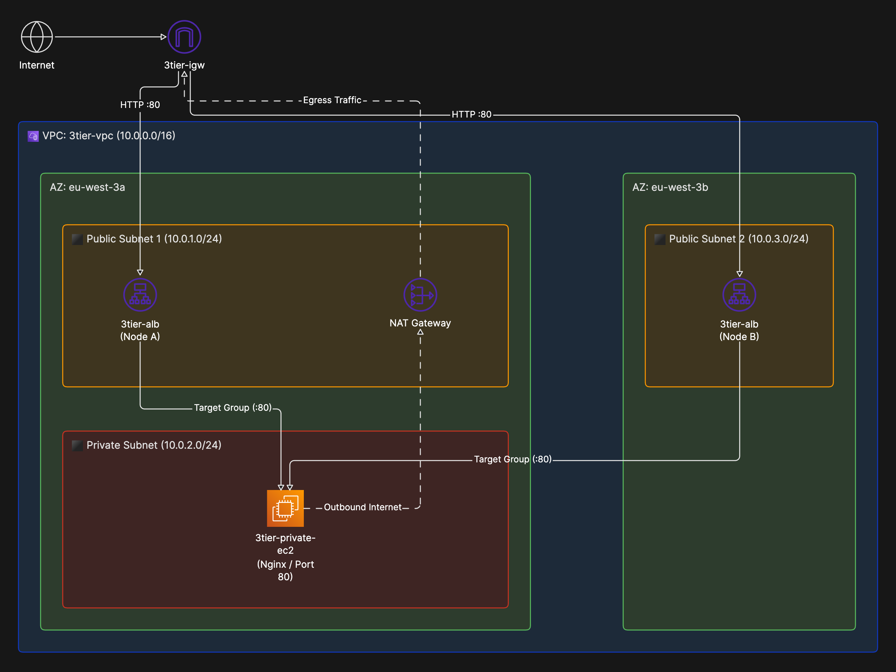
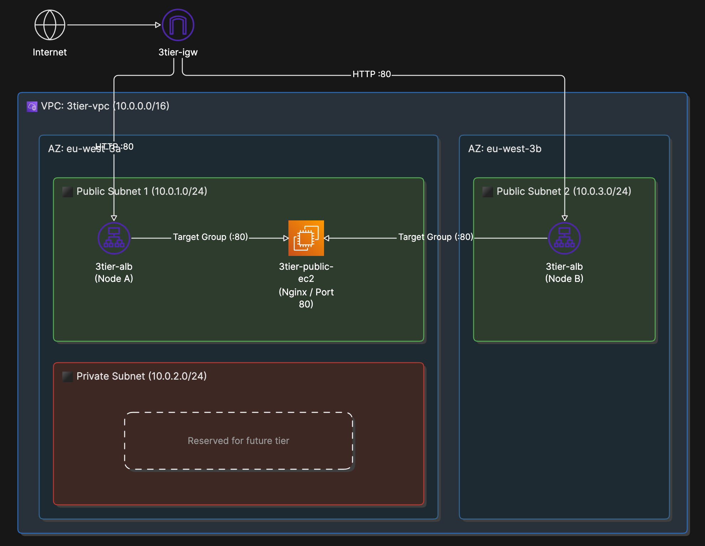
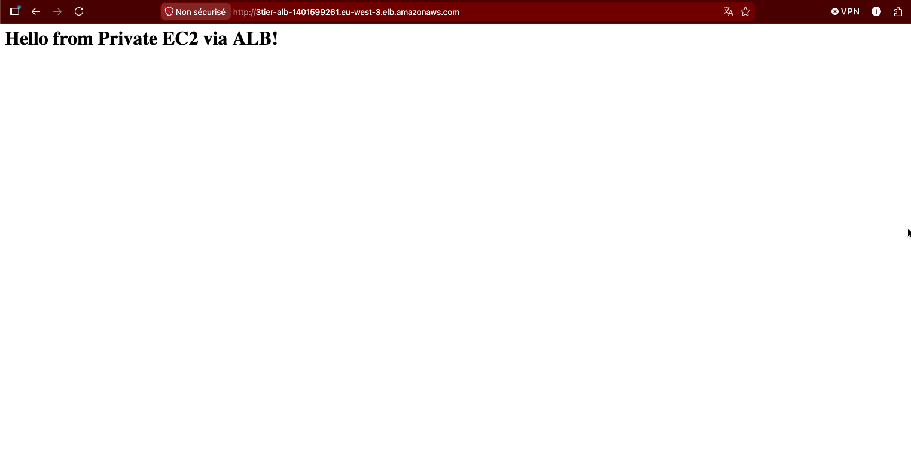

# AWS 3-Tier Architecture with Terraform


An IaC project deploying a highly available 3-tier web architecture on AWS using Terraform.

---

## Architecture & cost optimization

### Target architecture for production
In a prod environment, a 3-tier architecture isolates application servers inside a Private Subnet without public IP addresses. Outbound internet access (e.g., for package updates or dependencies) is routed through a NAT Gateway located in a public subnet.



### Deployed architecture (current: free tier)
An AWS NAT Gateway is billed hourly and is not covered by the AWS Free Tier. 

To prevent unnecessary costs for this demonstration project while maintaining proper security controls:
* The EC2 instance is placed in the public subnet with a public IP assigned for initialization (`user_data`).
* Security Group restriction: direct access to the EC2 instance is restricted; it only accepts inbound traffic from the Application Load Balancer (ALB) Security Group on port 80.



---

## Deployment & Validation

The application is deployed across two Availability Zones (`eu-west-3a` and `eu-west-3b`) for high availability. Inbound traffic is handled by the ALB and routed to the web server running Nginx.

### ALB Proof of Concept
The screenshot below confirms that the application is accessible through the public DNS endpoint of the ALB:



---

## Project Structure

```text
infra-aws-terraform/
├── images/
│   ├── without-nat.png
│   ├── with-NAT.png
│   └── screen-website.png
├── compute.tf
├── network.tf
├── providers.tf
├── .gitignore
└── README.md
```

## Prerequisites
* AWS CLI configured with appropriate credentials.
* Terraform installed.

**Quick start:**
```bash
# Initialize Terraform and download providers
terraform init

# Review the execution plan
terraform plan

# Apply changes to deploy the infrastructure
terraform apply
```

To clean up resources and avoid AWS charges:
```bash
terraform destroy
```

